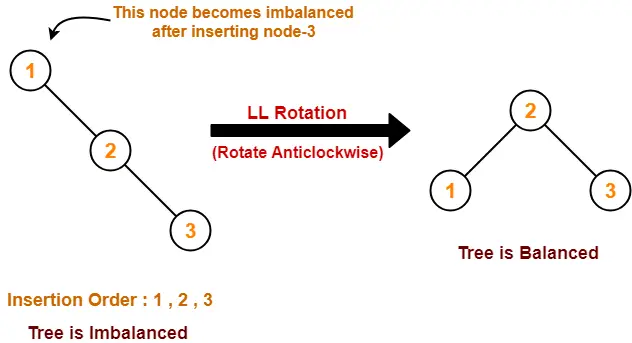
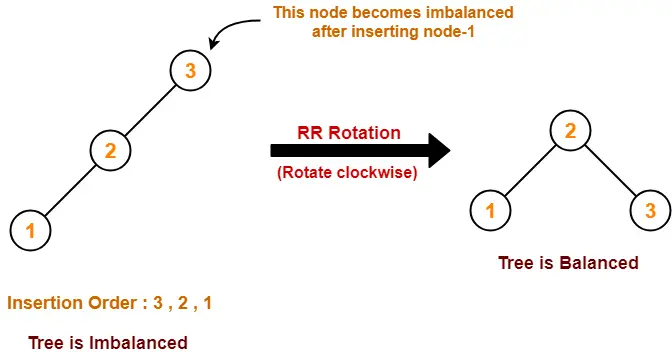
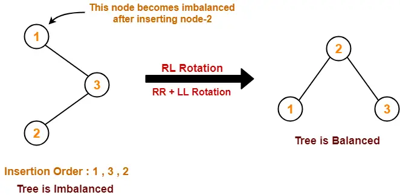
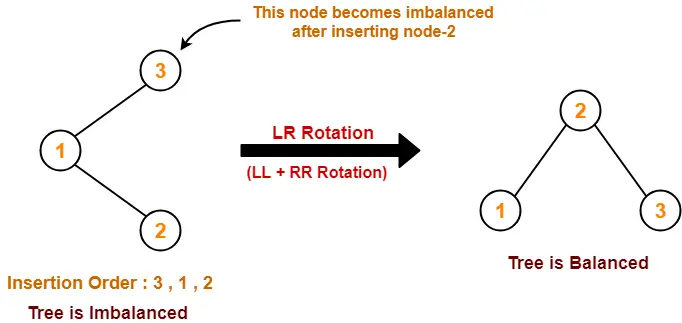
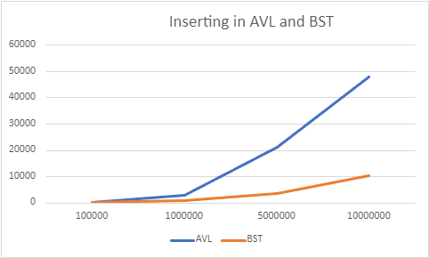

# Comparing insertion and searching in AVL and BST trees

# Introduction
We will compare searching and inserting mechanisms in AVL and BST trees.

# 1. BST Tree

    BST (Binary Search Tree) is a rooted binary tree structure, where left subtree contains
elements which has lower value than the root, and where right subtree contains values that 
are only bigger than root value. 
 
Both left and right subtrees are also binary search tree's.

## 1.1 Inserting in BST

Inserting in BST is pretty simple: at first, we compare potentially inserted value 
with one at the root. If it is bigger than root, we should move to the right subtree, else - move 
to the left. That process repeats until we found proper place for new value.
Create new node, and link it either right, or left node (from the parent perspective 
of view).

## 1.2 Searching in BST

Searching in BST is analogous to the insert function. Firstly, we compare 
value that we would like to find with the root value. If it is bigger than 
root - move to the right subtree. Else - move to the left subtree. Afterward,
repeat this process until you find your value, and return true or false respectively.
 
BST searching time is at least twice faster, because we skip at least half of 
whole array.

### 1.3 Time complexity
Time consumed for searching value in the BST is: 
O(h), where h is the height of the BST.

# 2. AVL Tree

AVL Tree (named in the lastname of inventors Adelson-Velsky and Landis) - is a
Bianry Search tree, with one exception. Difference of height of two child 
subtrees is either 1, 0 or -1. AVL tree also names self-balancing BST.
If occurs situation, where this difference differs more than 1, AVL tree
performs rotations. It changes order of subtrees, so that difference between any
left and right subtree of 1 parent will be different for at most 1. 
 

## 2.1 AVL Tree rotations

There is 4 types of AVL tree rotations: single and double.
 
Single rotations is Left-left and right-right while double is left-right and right-left.
What that mean? 
Let me demonstrate:  
As I said before, the difference between heights of two child nodes of one 
parent node should at most 1. For being a proper AVL tree, it needs to perform
rotation of nodes.    
1. Left-left:  
  
2. Right-right:  
  
3. Rightt-left:  
  
4. Left-right:  
     
This rotations keep AVL tree an AVL tree.

## 2.1 Insertion into AVL tree

Insertion into AVL tree works more complicated then in BST.
That all is because we need to balance AVL tree, when needed. 
 
First step: we do same steps as in BST - check root value, compare if it bigger or lower then it,
move right or left, and again. When inserted, we should check balance factor of each node. 
Balance factor is the difference between child nodes of parent node, as mentioned earlier,
if it is bigger than 1, we need to do rotations.  
If we found such node, where balance factor is bigger than 1, we are doing rotations. 
We are checking if balance factor is either bigger than 1, or lower than -1. 
If balance factor is bigger than 1 - left branch is bigger.  
Then, if the value of node is bigger than value leftNode - imbalance is in the
left subtree. If value of node is bigger - imbalance on the right. For the first
case, we need to perform left-left rotation, for the second - left-right rotation.
 
Same operations we perform with right subtree of root node, if needed.

## 2.2 Searching in AVL tree 

Searching in AVL tree is very similar to BST. We start from the root node, and compare 
value with root value. If it is bigger - move to the right subtree, if it is lower - 
to the left. Then, we do previous step again and again, till we find
what we wanted to find, and return true if number exists in AVL, and false if not.

# 3. Methodology

The BST and AVL was created in Golang. Data structures was filled with
randomly generated data (see utils.go). I have also provided appropriate tests (go test . -v)
We will insert 100 values to each Data structure, and take average time 
of insertion.  
Afterward, we will search for 100 values, and compare results.

# 4. Results

    Inserting into AVL and BST

| Elements count | AVL   |  BST    |
|----------------|-------|---------|
| 10000000       | 48121 | 10290   |
| 5000000        | 21303 | 3510    |
| 1000000        | 3037  | 766     |
| 100000         | 214   | 71      |

    Searching in AVL and BST

| Elements count  | AVL | BST |
|-----------------|-----|-----|
| 1500000         | 12  | 26  |
| 2500000         | 17  | 14  |
| 5000000         | 16  | 19  |
| 500000          | 10  | 15  |
| 100000          | 21  | 19  |

